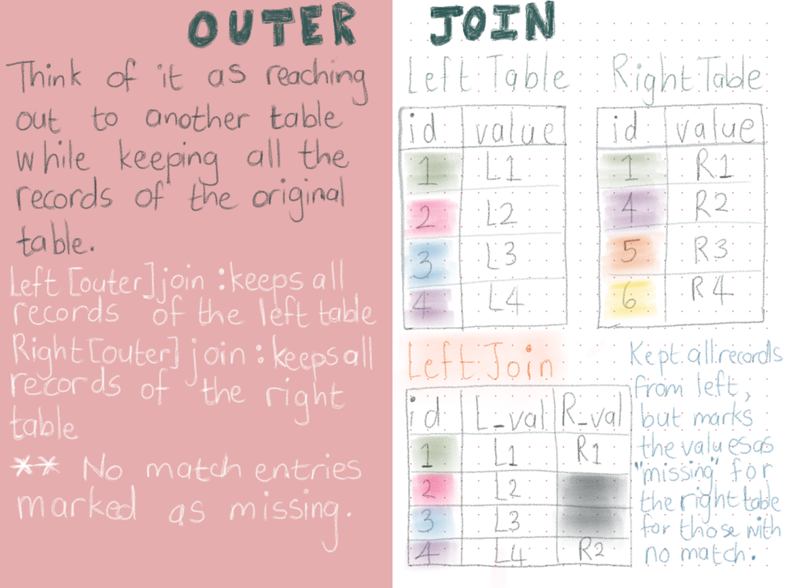

```{r distill-setup, include = FALSE}
# echo - Display code in output document (default = TRUE)
# eval - Run code in chunk (default = TRUE)
library(xaringanExtra)
library(rmarkdown)
xaringanExtra::use_clipboard()
```

{width="700"}
